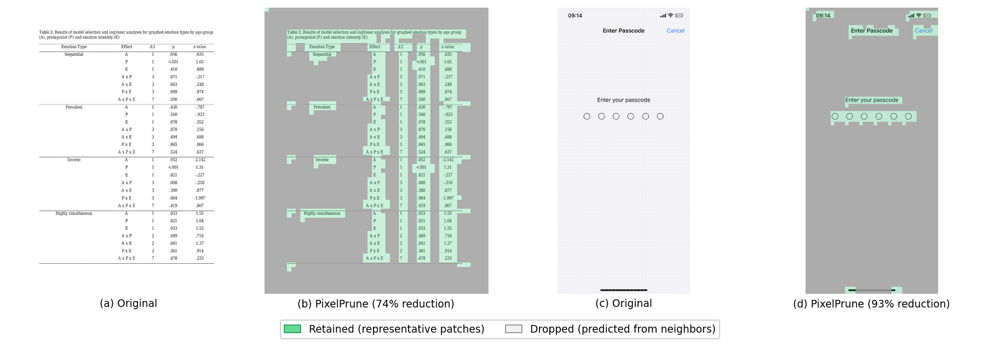

<h1 align="center">PixelPrune</h1>

<h3 align="center">Pixel-Level Adaptive Visual Token Reduction via Predictive Coding</h3>

<p align="center">
  <a href="http://arxiv.org/abs/2604.00886"></a>
  <a href="LICENSE"></a>
</p>

<p align="center">
  
</p>

PixelPrune compresses visual tokens **before** the ViT encoder via 2D predictive coding — no learnable parameters, training-free out-of-the-box, and compatible with FlashAttention. Fine-tuning is also supported for further gains. For technical details, see our [paper](http://arxiv.org/abs/2604.00886).

## Installation

```bash
git clone https://github.com/OPPO-Mente-Lab/PixelPrune.git
cd PixelPrune
pip install -e .
```
Tested with `transformers==4.57.6` and `vllm==0.18.0`. Qwen3.5 + HuggingFace requires `transformers>=5.2.0`.

## Quick Start

### HuggingFace

```python
import os
os.environ["PIXELPRUNE_ENABLED"] = "true"

from pixelprune import apply_pixelprune
apply_pixelprune(model="qwen3_vl")  # or "qwen3_5" for Qwen3.5
# call BEFORE loading the model

from transformers import AutoModelForImageTextToText, AutoProcessor

model_name = "Qwen/Qwen3-VL-2B-Instruct"  # or Qwen3.5 model path
model = AutoModelForImageTextToText.from_pretrained(
    model_name, dtype="auto", device_map="auto"
)
processor = AutoProcessor.from_pretrained(model_name)

# Document parsing example
messages = [
    {
        "role": "user",
        "content": [
            {"type": "image", "image": "assets/doc.jpg"},
            {"type": "text", "text": "Parse this table into Markdown format."},
        ],
    }
]

inputs = processor.apply_chat_template(
    messages, tokenize=True, add_generation_prompt=True,
    return_dict=True, return_tensors="pt",
).to(model.device)

generated_ids = model.generate(**inputs, max_new_tokens=1024)
generated_ids_trimmed = [
    out_ids[len(in_ids):] for in_ids, out_ids in zip(inputs.input_ids, generated_ids)
]
print(processor.batch_decode(generated_ids_trimmed, skip_special_tokens=True)[0])
```

### vLLM

```python
import os
os.environ["PIXELPRUNE_ENABLED"] = "true"

from pixelprune import apply_pixelprune
apply_pixelprune(model="qwen3_vl", backend="vllm")  # or "qwen3_5" for Qwen3.5
# call BEFORE creating LLM

from PIL import Image
from transformers import AutoProcessor
from vllm import LLM, SamplingParams

if __name__ == "__main__":
    model_name = "Qwen/Qwen3-VL-2B-Instruct"  # or Qwen3.5 model path
    processor = AutoProcessor.from_pretrained(model_name)
    image = Image.open("assets/doc.jpg").convert("RGB")

    messages = [{"role": "user", "content": [
        {"type": "image"},
        {"type": "text", "text": "Parse this table into Markdown format."},
    ]}]
    prompt = processor.apply_chat_template(messages, tokenize=False, add_generation_prompt=True)

    llm = LLM(model=model_name, max_model_len=4096)
    outputs = llm.generate(
        {"prompt": prompt, "multi_modal_data": {"image": image}},
        sampling_params=SamplingParams(max_tokens=1024, temperature=0.0),
    )
    print(outputs[0].outputs[0].text)
```

Currently supports **Qwen3-VL** and **Qwen3.5** on both HuggingFace and vLLM backends (see examples above). PixelPrune is controlled via environment variables:

| Variable | Default | Description |
|:---------|:--------|:------------|
| `PIXELPRUNE_ENABLED` | `false` | Enable/disable PixelPrune |
| `PIXELPRUNE_THRESHOLD` | `0` | Similarity threshold τ for deduplication with max error |
| `PIXELPRUNE_VERBOSE` | `false` | Print per-image pruning stats (tokens kept, compression ratio, latency) |

## Evaluation

We provide evaluation scripts built on a bundled (and modified) copy of [VLMEvalKit](https://github.com/open-compass/VLMEvalKit) under `eval/`.

### Setup

```bash
# Install VLMEvalKit dependencies
pip install -e eval/
```

### Reproduce Paper Results

**Document understanding** (Table 1, training-free):

```bash
# Qwen3-VL-2B on all 7 document benchmarks
bash scripts/eval_doc.sh Qwen/Qwen3-VL-2B-Instruct

# Qwen3-VL-4B / 8B
bash scripts/eval_doc.sh Qwen/Qwen3-VL-4B-Instruct
bash scripts/eval_doc.sh Qwen/Qwen3-VL-8B-Instruct

# Full baseline (no PixelPrune) for comparison
bash scripts/eval_full_baseline.sh Qwen/Qwen3-VL-2B-Instruct
```

**GUI understanding** (Table 2, requires fine-tuned checkpoint):

```bash
bash scripts/eval_gui.sh Qwen/Qwen3-VL-2B-Instruct  # or fine-tuned checkpoint path
```

**Custom dataset subset**:

```bash
bash scripts/eval_doc.sh Qwen/Qwen3-VL-2B-Instruct "DocVQA_VAL OCRBench"
```

## Training

See [`training/README.md`](training/README.md) for details. Supports both CE and self-distillation (KD) training for Qwen3-VL and Qwen3.5.

```bash
cd training
pip install -r requirements.txt

export PIXELPRUNE_ENABLED=true
export PIXELPRUNE_THRESHOLD=0.0

deepspeed --num_gpus 8 train.py \
    --deepspeed_config_path    configs/deepspeed_config.json \
    --training_config_path     configs/training_config.json \
    --task_info_config_path    configs/task_info.json \
    --task_weight_config_path  configs/task_weight.json
```

## Citation

```bibtex
@misc{wang2026pixelprunepixelleveladaptivevisual,
      title={PixelPrune: Pixel-Level Adaptive Visual Token Reduction via Predictive Coding}, 
      author={Nan Wang and Zhiwei Jin and Chen Chen and Haonan Lu},
      year={2026},
      eprint={2604.00886},
      archivePrefix={arXiv},
      primaryClass={cs.CV},
      url={https://arxiv.org/abs/2604.00886}, 
}
```

## Acknowledgements

This work builds on the [Qwen3-VL](https://github.com/QwenLM/Qwen3-VL) model family. Evaluation is conducted using [VLMEvalKit](https://github.com/open-compass/VLMEvalKit).

## License

This project is licensed under the [Apache License 2.0](LICENSE).
